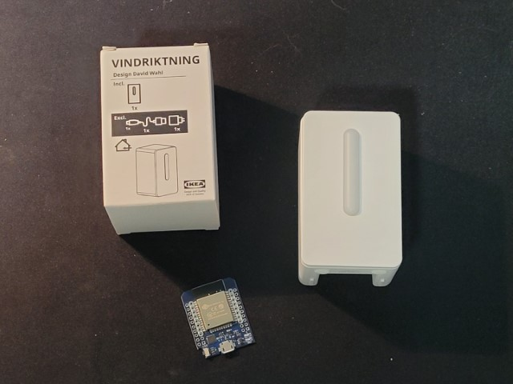
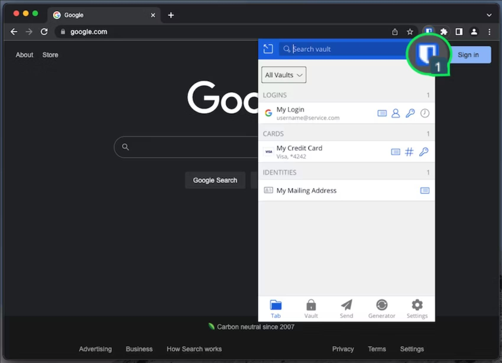

# Smarthome with Home Assistant, ESPHome, and OpenMediaVault

## Home Assistant  
Build a smarthome with the guides below using [Home Assistant](https://www.home-assistant.io/), [ESPHome](https://esphome.io), and Bluetooth sensors like temperature, motion, air quality.

### Setup Home Assistant on a thin client internal SSD using Linux live session
[Home Assistant on a thin client guide](home-assistant/hassio-thin-client-setup.md) explains how to setup and run Home Assistant on low power & low cost ($50 or less) thin client as an alternative to a Raspberry Pi or Home Assistant Blue. The guide explains how to use a Linux live session from a Xubuntu OS USB drive running directly on the thin client to install Home Assistant Operating System.

### Enabling secure HTTPS remote web access to Home Assistant
[Enabling secure HTTPS remote web access to Home Assistant guide](home-assistant/hassio-https-remote-access.md) explains how to set up secure HTTPS remote web access to your Home Assistant installation. This way, you can access Home Assistant dashboard and control your smart home when your away instead of just through your local home network.

### Vacation mode lighting with historical replay
[Vacation mode lighting with historical replay guide](home-assistant/hassio-vacation-mode.md) explains how to create a vacation mode toggle switch in Home Assistant dashboard that turns on and off smart lights when you're away following historical patterns. This way, the smart lights in your home will turn on and off when you are away in the same patterns as when you were home.  

### Home Assistant room temperature and humidity with Bluetooth temperature sensor and ESPHome

[Home Assistant room temperature and humidity with Bluetooth temperature sensor and ESPHome guide](esphome/ble-temperature-sensor.md) explains how to integrate room temperature and humidity measurements and logging in Home Assistant using a low cost Bluetooth Low Energy (BLE) thermometer and ESP32 microcontroller running ESPHome software.  

**Great for beginners**. This is one of the easiest ESPHome projects to build with no tools required.  

### Home Assistant motion detection with Bluetooth motion sensor and ESPHome

[Home Assistant motion detection with Bluetooth motion sensor and ESPHome guide](esphome/ble-motion-sensor.md) how to create automations in Home Assistant that trigger actions like turning on or off lights based on a Bluetooth motion and ambient light sensor. 

**Intermediate difficulty level**. This guide assumes you've completed the [Home Assistant room temperature and humidity with Bluetooth temperature sensor and ESPHome guide](ble-temperature-sensor.md) which explains how to configure ESPHome to passively monitor Blueooth LE sensors and connect ESPHome with Home Assistant. 

### Home Assistant air quality sensor with IKEA VINDRIKTNING and ESPHome

[Home Assistant air quality sensor with IKEA VINDRIKTNING and ESPHome guide](esphome/particulate-sensor.md) explains how to modify a low cost ($13 USD) IKEA VINDRIKTNING air quality sensor into a Home Assistant smart sensor by adding a low cost ($5 USD) ESP32 microcontroller and running ESPHome software.

**Soldering required.**. This project depends on device hardware modifications and involves some soldering.

### Improving Home Assistant privacy by storing passwords in secrets.yaml
Coming soon.

### Visualizing Home Assistant sensor data history in Grafana
Coming soon.

## Bitwarden Password Manager
[Self-host Bitwarden Password Manager in HomeAssistant guide](bitwarden/bitwarden-password-manager.md) explains how to install [Bitwarden](https://bitwarden.com) password manager as a [Home Assistant](https://www.home-assistant.io/) add-on to securely store your passwords while having convenient access from the web browser and mobile apps. Bitwarden supports increased security with Two-Factor Authentication (2FA) with verification code and designated contacts for emergency access. For better security, the password manager server application is not accessible to the internet, and is only accessible from your local home network or through a VPN.  

## Media server  
Build a self-hosted, Linux-based home network file server so your photos and videos are accessible from any device, mount a TV antenna in the attic to watch free live TV on a tablet or smartphone, ...

### Configuring remote acess to a linux PC
[Configuring remote acess to a linux PC guide](media-server/linux-remote-access.md) explains how to remotely access a Linux PC's terminal shell using SSH and graphical desktop using VNC server software.  

### Push notifications from linux server to mobile
[Enabling push notifications from linux server to mobile with ntfy.sh](media-server/push-notifications-ntfy.md)
explains how to use free [https://ntfy.sh](https://ntfy.sh) Android or iOS app to get push notifications from Linux media server.  

### Setup home file and media server OpenMediaVault on a Raspberry Pi or an old PC
Coming soon.

### Cord-cutting with long range attic TV antenna + HDHomeRun network TV tuner
[Cord-cutting with long range attic TV antenna + HDHomeRun network TV tuner guide](media-server/attic-tv-antenna.md) explains how to cut the cord, stop paying subscription fees to watch live TV, get great local TV reception using a long range TV antenna mounted in the attic, and watch live TV on a tablet or smartphone using a HDHomeRun network TV tuner.
