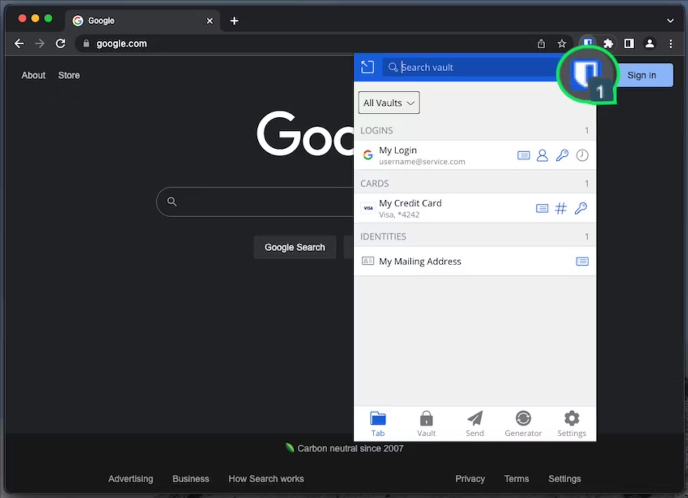
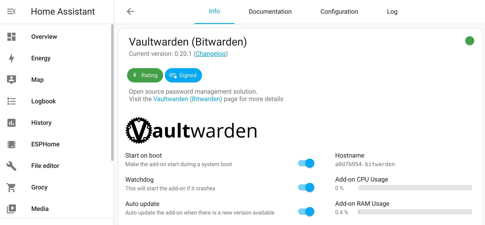
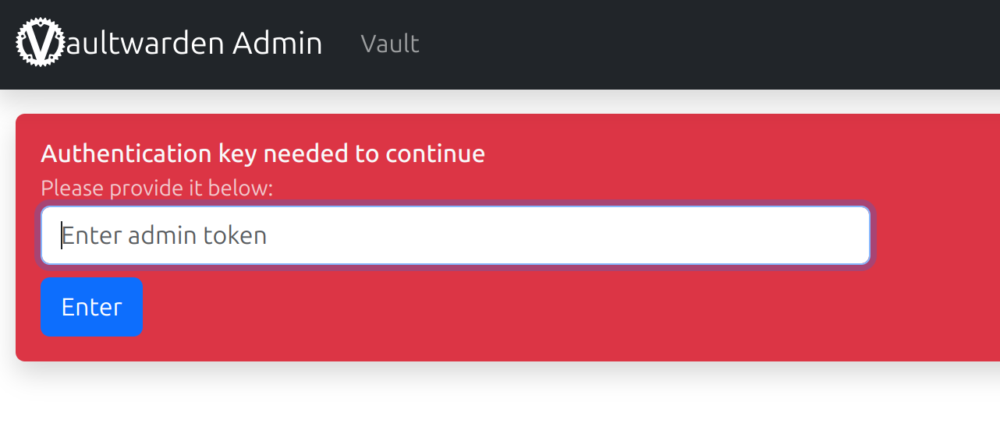
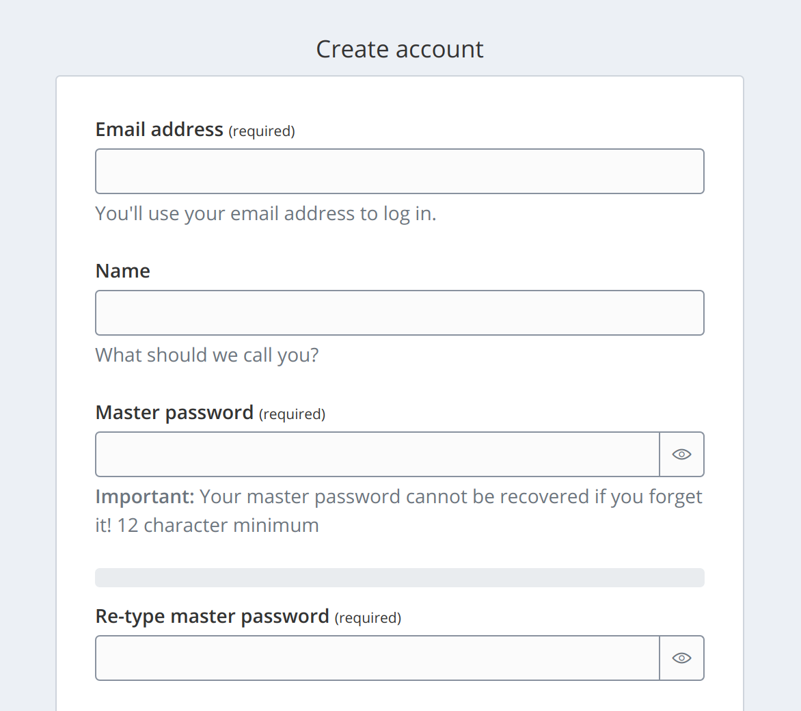
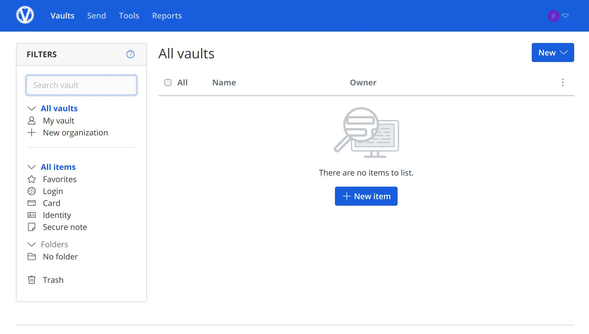
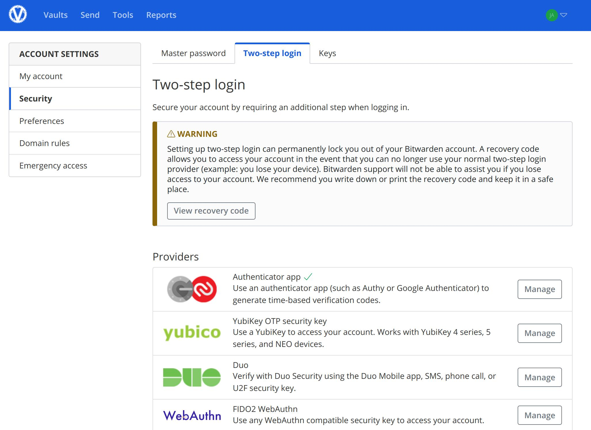
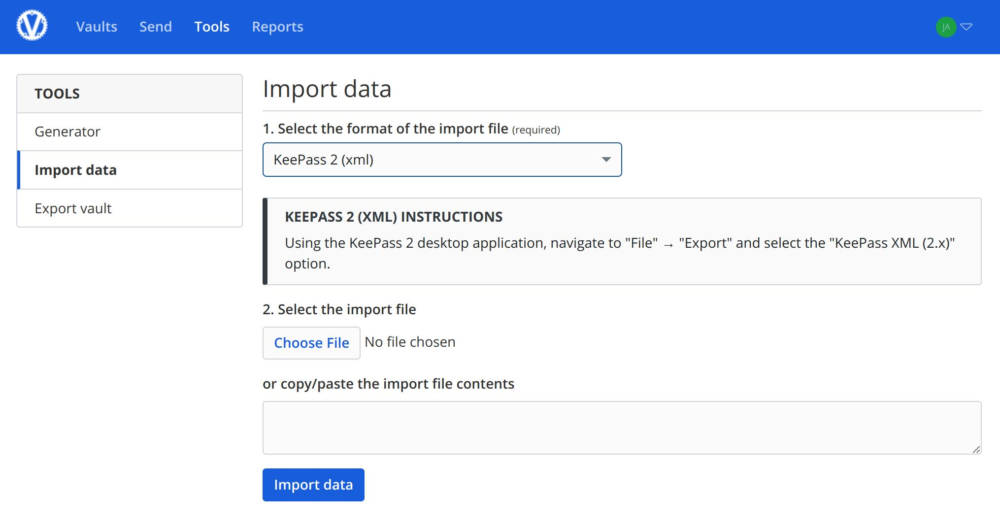
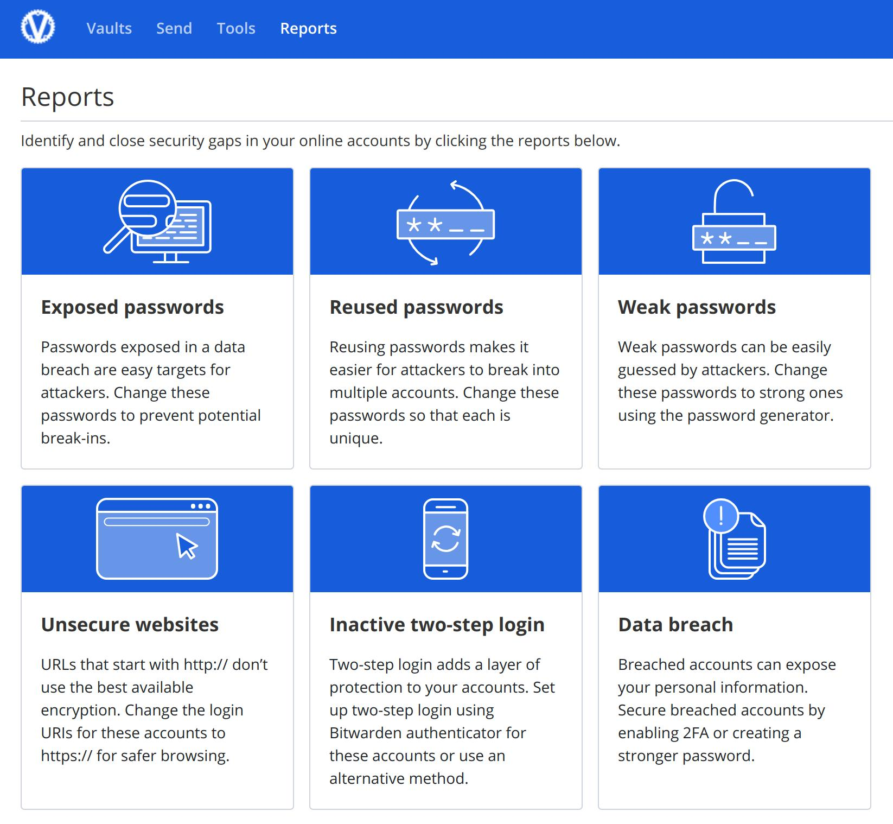

# Self-host Bitwarden Password Manager in HomeAssistant
This guide shows how to install a self-hosted [Bitwarden](https://bitwarden.com) password manager as a [Home Assistant](https://www.home-assistant.io/) add-on to securely store your passwords while having convenient access from the web browser and mobile apps. Bitwarden supports increased security with Two-Factor Authentication (2FA) with verification code and designated contacts for emergency access. For better security, the password manager server application is not accessible to the internet, and is only accessible from your local home network or through a VPN.  



## Overview
Bitwarden is a open-source, supports multiple user accounts, and supports cross-platform sync with web browser extensions and mobile apps. Bitwarden includes a server application that securely stores passwords in a digital vault, and various web browser extensions and mobile app clients that connect to a Bitwarden server. Bitwarden provides customized reports based on analysis of your saved passwords. 

[Vaultwarden](https://github.com/dani-garcia/vaultwarden) is an unofficial version of Bitwarden server application that's more suitable for a self-hosted installation in Home Assistant for individual or family use.  

To use Bitwarden, you'll need to install and configure Vaultwarden server application as a HomeAssistant add-on, then configure HomeAssistant SSL certificate and network settings, then configure Vaultwarden application settings, create user accounts, import saved passwords from your web browser or old password manager app, and install and setup Bitwarden browser extension and mobile apps.  

**Prerequisites**
- [Home Assistant](https://www.home-assistant.io/) Operating System already installed on Raspberry Pi, single board computer or PC. See [Setup Home Assistant on a thin client](.../home-assistant/hassio-thin-client-setup.md) guide as an example.
- Configured your network router to assign a static IP address to your Home Assistant server.  
- Your network router supports custom DNS override or custom DHCP hostname. Examples include Pi-Hole, OpenWrt and OPNsense.  
- If you want to save or edit saved passwords in Bitwarden when you are away from home, then you'll need a VPN server (ex: Wireguard) for your home network. This is optional, as you don't need a VPN to view passwords using Bitwarden web browser extension or mobile app.  

## Install Vaultwarden HomeAssistant add-on
[Vaultwarden](https://github.com/dani-garcia/vaultwarden) is an unofficial version of Bitwarden server application that's more suitable for a self-hosted installation in HomeAssistant for individual or family use.  



Follow [Vaultwarden HomeAssistant add-on installation instructions](https://github.com/hassio-addons/addon-bitwarden/blob/main/bitwarden/DOCS.md) to install the Vaultwarden HomeAssistant add-on. 

**Important:** Check the Vaultwarden add-on log after installation to get the admin token/password. Save this token and keep this token a secret, as this is the password for accessing Vaultwarden admin settings. The add-on will not display the token again!

### Login to Vaultwarden admin settings
Navigate to Vaultwarden server admin settings page, typically http://homeassistant.local:7277/admin. Alternatively, login to HomeAssistant, then navigate to Vaultwarden add-on page, then select the **OPEN WEB UI** button. Enter the admin token from the Vaultwarden log displayed after installation.



### Create a new secure admin token
To improve security, create a new Vaultwarden admin token that uses `argon2` hash. Follow the instructions below from [Vaultwarden wiki](https://github.com/dani-garcia/vaultwarden/wiki/Enabling-admin-page).

Using a Linux computer's terminal, run the command below, replacing `MySecretPassword` with your admin password.

```bash
# Using the Bitwarden defaults
echo -n "MySecretPassword" | argon2 "$(openssl rand -base64 32)" -e -id -k 65540 -t 3 -p 4
# Output: $argon2id$v=19$m=65540,t=3,p=4$bXBGMENBZUVzT3VUSFErTzQzK25Jck1BN2Z0amFuWjdSdVlIQVZqYzAzYz0$T9m73OdD2mz9+aJKLuOAdbvoARdaKxtOZ+jZcSL9/N0
```

Copy the output text PHC string (the text that begins with `$argon2id`), and enter it in Vaultwarden admin page under **Admin token/Argon2 PHC**. The next time you login to Vaultwarden admin page, enter your admin password (e.g. MySecretPassword) to login instead of entering the token.  

## Connect to Bitwarden using HTTPS
For security, Bitwarden server requires a HTTPS connection, even for connections in your local network. To connect to your Bitwarden server using HTTPS, you'll need to create a free dynamic DNS web domain for your HomeAssistant server (ex: [Duck DNS](https://www.duckdns.org)), configure [HomeAssistant DuckDNS add-on](https://github.com/home-assistant/addons/blob/master/duckdns/DOCS.md) to get a SSL certificate, and configure your router or device to override DNS.  

### Create Duck DNS web domain and SSL certificate
[Duck DNS](https://www.duckdns.org) offers free web domains under *duckdns.org*, and HomeAssistant includes a convenient [DuckDNS add-on](https://github.com/home-assistant/addons/blob/master/duckdns/DOCS.md) that obtains the LetsEncrypt SSL certificate necessary for HTTPS connection.   

**Instructions**  
Install [HomeAssistant DuckDNS add-on](https://github.com/home-assistant/addons/blob/master/duckdns/DOCS.md) by following the installation and configuration instructions.  
1. Navigate to [duckdns.org](https://www.duckdns.org), sign up for a free account, note your token ID, and create your custom sub domain under *duckdns.org*.  
2. Then, update HomeAssistant add-on configuration with your DuckDNS token and domain.
3. In Vaultwarden admin settings, set the domain to your HomeAssistant web domain and Vaultwarden port (ex: https://mydomain.duckdns.org:7277)

### Configure DNS override
You'll need to configure DNS override in your network router so that devices connecting to your HomeAssistant web domain are routed to the local IP address of your HomeAssistant server.  

The exact steps varies depending on the model of your network router.  

**Instructions**  

**[Pi-Hole](https://pi-hole.net)**
1. Login to Pi-Hole admin page, then navigate to "**Local DNS -> DNS Records**" (/admin/dns_records.php). 
2. Select "**Add**" button, then use your Duck DNS sub domain (ex: mydomain.duckdns.org) for **Domain** and use the local IP address of your HomeAssistant server (ex: `192.168.1.10`) for **IP Address**.

**[OPNsense](https://opnsense.org)**  
1. Login to your OPNsense router admin page, then navigate to the "**Services > Unbound DNS > Overrides**" page. 
2. Under "**Host Overrides**" tab, select the "**+**" button, then select "Enabled" checkbox, enter your sub domain (ex: mydomain) under **Host**, enter `duckdns.org` under **Domain**, enter the local IP address of your HomeAssistant server (ex: `192.168.1.10`) under IP address. 
3. Select **Save**, then select **Apply**.  

**[OpenWrt](https://openwrt.org)**   
Follow OpenWrt instructions for [configuring DHCP custom hostname](https://openwrt.org/docs/guide-user/base-system/dhcp_configuration#hostnames).  
Use your Duck DNS sub domain (ex: mydomain.duckdns.org) for `name` and use the local IP address of your HomeAssistant server (ex: `192.168.1.10`) for `ip`.  

**Test your HTTPS connection**  
Navigate to your Duck DNS sub domain using HTTPS (ex: https://mydomain.duckdns.org:7277), and you should see Bitwarden (Vaultwarden) server login page. Your web browser should display the connection is secure and should not display any warning or error messages about invalid certificates.  

For better security, the computer running Bitwarden server application should not be accessible from the internet and should only be accessible through your local home network. You don't need remote access or a VPN to view passwords using Bitwarden web browser extension or mobile app. You'll need a VPN server (ex: [Wireguard](https://www.wireguard.com)) for remote access to your home network if you want to save new passwords or edit saved passwords when you are away from home. Using an on-demand VPN remote access connection provides both convenient access and improved security against cyberattacks.  

## Create user accounts 
Navigate to your  Bitwarden (Vaultwarden) server using HTTPS (ex: https://mydomain.duckdns.org:7277). Select **Create account**, then enter your email address, name, and create a **strong** password. This is the password that you'll use later to login and view your saved passwords. 

**Important:** Keep this password a secret, and don't lose or forget it. If you lose or forget your account password, you won't be able to unlock vault to view your saved passwords.  



After login, you'll be taken to the Bitwarden **Vault** page.



### Enable 2FA (Two-Factor Authentication)
Bitwarden supports two-factor login, and requiring a separate verification code to login enhances protection for unauthorized data access.  

To require a separate verification code to login, navigate to your  Bitwarden (Vaultwarden) server (ex: https://mydomain.duckdns.org:7277), enter your username and password. Next, select your profile icon to view profile menu, then select **Account settings**. Select **Security**, then select **Two-step login** tab. Follow the instructions to register your authenticator app (ex: Authy or Microsoft Authenticator) with Bitwarden.  



## Import data from your current password manager into Bitwarden vault
If you already saved passwords in your web browser or with a different app, you can import the data into your Bitwarden vault instead of re-entering the data.  

**Note**: Bitwarden does not check for duplicates when importing data, so you will need to manually delete any duplicate entries.  



**Chrome/Edge web browser**
Follow [Import from Chrome](https://bitwarden.com/help/import-from-chrome/) instructions to export saved passwords from Chrome web browser. The same instructions should work any Chromium web browser like [Edge](https://www.microsoft.com/edge), [Brave](https://brave.com), or [Vivaldi](https://vivaldi.com).  

**Keepass 2**  
 - **Export from Keepass**: Using the KeePass 2 desktop application, navigate to **File** > **Export** and select the **KeePass XML (2.x)** option.
- **Import to Bitwarden**: Login to your Bitwarden  (Vaultwarden) vault stored on your server, then **Tools** tab, then select **Import data**. Under file format menu, select “**KeePass 2 (xml)**. Select the .xml file exported from Keepass 2, and select **Import data** button.  

## Install and setup Bitwarden web browser extension and mobile apps
The Bitwarden web browser extension and mobile apps provide more convenient ways to login with saved passwords than navigating to your Bitwarden server web page. The standard Bitwarden browser extension and mobile apps work with Vaultwarden server.     

### Bitwarden web browser extension
Bitwarden web browser extension is more convenient to use by auto-filling your saved passwords and auto-saving new login and passwords created. Install Bitwarden browser extension from your web browser's app store or by following [Bitwarden browser extensions](https://bitwarden.com/help/getting-started-browserext/) instructions.  

### Bitwarden mobile apps
Bitwarden web browser extension is more convenient to use by supporting biometric unlock of Bitwarden vault, and auto-filling your saved passwords. Install Bitwarden from your mobile app store or by following [Bitwarden mobile app](https://bitwarden.com/help/getting-started-mobile/) instructions.  

## Bitwarden reports
Identify problems with your saved passwords by reviewing personalized password health reports Bitwarden generates. To see your report, follow [Bitwarden Vault Health Reports](https://bitwarden.com/help/reports/) instructions.



## Configure email settings
Coming soon.

## Enable Emergency Access
Coming soon.