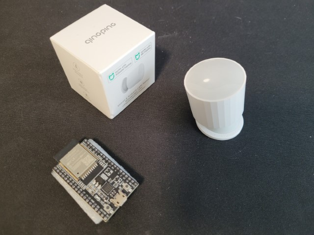

# Home Assistant door opening detection with Bluetooth sensor and ESPHome


This guide explains how to create automations in [Home Assistant](https://www.home-assistant.io/) to automatically turning on or off lights based on a Bluetooth window/door sensor. The guide uses a low cost ($12 USD) Bluetooth Low Energy (BLE) window/door sensor with a low cost ($5 USD) Bluetooth LE gateway built using a [ESP32](https://en.wikipedia.org/wiki/ESP32) microcontroller running [ESPHome](https://esphome.io) software to connect with Home Assistant.


## Overview
Want to automatically turn off the lights after closing a door? If you answered yes, then this guide will help you create a smart home automation that automatically turns off lights in a room at night when people are in the room and automatically turns off lights after people leave. Home Assistant can be configured to change device state (e.g. turn off a light) based on the status of door opening sensors.  
  
With the Xiaomi door & window sensor 2 (MCCGQ02HL), there's no electrical wiring needed because it's battery powered and has Bluetooth Low Energy wireless connectivity.

**Prerequisites**
- [Home Assistant](https://www.home-assistant.io/) already installed on Raspberry Pi, single board computer or PC. See [Setup Home Assistant on a thin client](.../home-assistant/hassio-thin-client-setup.md) guide as an example.
- Completed setup and configuration of Home Assistant integration for your smart Wi-Fi plug, light bulb, or light switch.
- [ESPHome](https://esphome.io) configured as Bluetooth Low Energy device scanner running on a [ESP32](https://en.wikipedia.org/wiki/ESP32) microcontroller. 

*Note:* This guide assumes you've completed the [Home Assistant room temperature and humidity with Bluetooth temperature sensor and ESPHome guide](ble-temperature-sensor.md) which explains how to configure ESPHome to passively monitor Blueooth LE sensors and connect ESPHome with Home Assistant. 

**Hardware required**
- [Xiaomi door & window sensor 2 (MCCGQ02HL)]
- [ESP32](https://en.wikipedia.org/wiki/ESP32) microcontroller
- PC with Bluetooth for initial sensor pairing
- Smart Wi-Fi plug, light bulb, or light switch compatible with Home Assistant (ex: Philips Hue, Belkin WeMo, TP-Link Kasa)

**Software required**
- [Home Assistant](https://www.home-assistant.io/)
- [Xiaomi Cloud Tokens Extractor](https://github.com/PiotrMachowski/Xiaomi-cloud-tokens-extractor)
- [ESPHome](https://esphome.io)
- [Xiaomi door & windows sensor 2 (MCCGQ02HL) component](https://github.com/Fabian-Schmidt/esphome-xiaomi_mccgq02hl)
- [ESPHome Web](https://web.esphome.io)

**Tools required**
- No special tools needed, nothing to take apart or disassemble.

### Xiaomi Door & Window sensor 2 (MCCGQ02HL)
Xiaomi Door & Window sensor 2 (MCCGQ02HL) is a small battery powered sensor with Bluetooth wireless connectivity.  
- Includes a magnet sensor that detects proximity to a magnet within about 2 cm range.
- Comes with adhesive wall mount sticker
- Powered by 1 replaceable coin cell batteries
- Has integrated Bluetooth Low Energy (BLE) wireless connectivity that will be used to integrate this sensor with Home Assistant
- Can be used with Home Assistant after bind key 
- Powered by Telink TLSR825x series ultra low power [microcontroller](https://en.wikipedia.org/wiki/Microcontroller) designed for Internet of Things (IoT)
- 
## Instructions
Building this is separated into 4 phases
1. Obtain the MCCGQ02HL device's bind key and Bluetooth MAC address using [Xiaomi Cloud Tokens Extractor](https://github.com/PiotrMachowski/Xiaomi-cloud-tokens-extractor)
2. Update ESPHome configuration to detect Bluetooth sensor
3. Configure Home Assistant integration for ESPHome
4. Configure Home Assistant automation to turn on and off turn on a light, switch, scene, script or group based on the door sensor.

Before proceeding, review the **Prerequisites** section to check that you have Home Assistant already running with a smart light bulb, smart plug, or smart switch, and ESPHome is already running to monitor Bluetooth LE devices.

## Step 1: Obtain the device Mi bind key and Bluetooth MAC address
You'll need to provide the Mi bind key and Bluetooth MAC address in the ESPHome configuration in order to integrate the device into Home Assistant. The MCCGQ02HL sensor device broadcasts data in an encrypted format designed to work with Xioami Mijia smarthome ecoysystem, but the format has been decoded to work with Home Assistant if you obtain the device Mi bind key.  

1. Pair the sensor with Xiao Mi home app. On the MCCGQ02HL sensor, enable pairing mode by pressing the side button for 3 seconds until the LED light flashes 3 times.
2. Extract the device's MAC address, Mi token and Mi bind key using [Xiaomi Cloud Tokens Extractor](https://github.com/PiotrMachowski/Xiaomi-cloud-tokens-extractor)

## Step 2: Update ESPHome configuration to detect Bluetooth LE sensor
Now that you have obtained the bind key and Bluetooth MAC address for your door open sensor device, the next step is configuring [ESPHome](https://esphome.io) software on your [ESP32](https://en.wikipedia.org/wiki/ESP32) microcontroller to listen to door opening Bluetooth data broadcasted by your sensor device, and then re-transmit that data through your Wi-Fi network to Home Assistant.

1. Within the ESPHome Dashboard, select "Edit" button to edit the ESPHome .yaml configuration. Use [my sample ESPHome configuration.yaml](esp-ble-door.yaml) as a reference and add the following to the .yaml config. Update `mac_address` with the MAC address you determined in the previous step.
```yaml
external_components:
  - source: github://Fabian-Schmidt/esphome-xiaomi_mccgq02hl
    components: [ xiaomi_ble, xiaomi_mccgq02hl ]

esp32_ble_tracker:

xiaomi_mccgq02hl:
  - id: door1
    mac_address: A1:B1:C1:D1:E1:F1 # Device MAC address
    bindkey:  "5f60b65c144f3c6b8fdae819fca6f614"

binary_sensor:
  - platform: xiaomi_mccgq02hl
    id: door1
    light:
      name: "Door Sensor Light"
    open:
      name: "Door Sensor Open"

sensor:
  - platform: xiaomi_mccgq02hl
    id: door1
    battery_level:
      name: "Door Sensor Battery Level"

# Auto daily reset
time:
  - platform: homeassistant
    on_time:
      - seconds: 0
        minutes: 0
        hours: 4
        days_of_week: MON-SUN
        then:
           - switch.toggle: restart_switch
switch:
  - platform: restart
    name: "ESP restart"
    id: restart_switch
```
3. Select **Save**, then select **Install**. Your ESP32 should have successfully connected to your Wi-Fi network and should be detected as online in ESPHome Dashboard at this point, so **Wirelessly** is the easiest option. If your ESP32 is not detected as online in ESPHome Dashboard, then double check you've configured the correct Wi-Fi SSID and password in your configuration.yaml file.

## Step 3: Configure Home Assistant integration for ESPHome
After configuring ESP32 to detect door open data broadcasted by your Bluetooth LE sensor and re-transmit the data as a Home Assistant binary sensor, the next step is to enable ESPHome integration so that ESPHome dashboard displays temperature and humidity data.

Follow the instructions in *"Step 3: Configure Home Assistant integration for sensors in the Bluetooth thermometer"* in [Home Assistant room temperature and humidity with Bluetooth temperature sensor and ESPHome guide](ble-temperature-sensor.md). Proceed to the next step after Home Assistant Overview dashboard displays the new door open sensors. 

## Step 4: Configure Home Assistant automation triggered by door open sensors
Now that door open sensor data is integrated into Home Assistant, the last steps is to automate Home Assistant to trigger an action to turn on a light, switch, scene, script or group based on door open state. Use the new door open sensor entity as the [automation trigger](https://www.home-assistant.io/docs/automation/trigger/).  

For detailed instructions, see [State trigger](https://www.home-assistant.io/docs/automation/trigger/#state-trigger) and   [HomeAssistant Automations documention](https://www.home-assistant.io/docs/automation/basics/).  

## Conclusion
Congratulations! Your lights can now automatically turned off at night when door is closed.  

With the low cost of the Bluetooth LE door open sensors, you can buy a few and place them in each area of your home to control different rooms. A single ESP32 microcontroller can detect data broadcast from multiple Bluetooth thermometers.

For more information about automations, see 
* [Learn about automation basics](https://www.home-assistant.io/docs/automation/basics/)
* [Learn about automating Home Assistant](https://www.home-assistant.io/docs/automation/)
