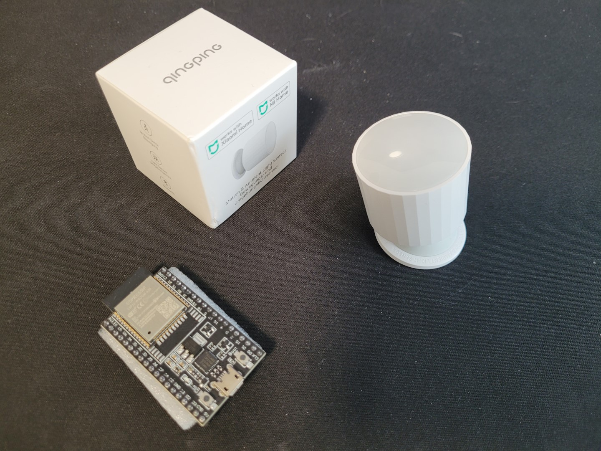
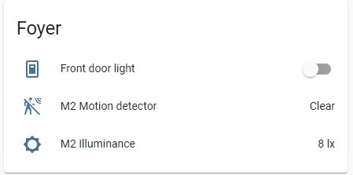
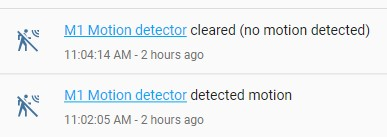
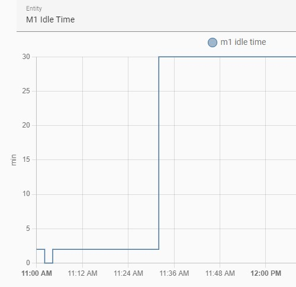

# Home Assistant motion detection with Bluetooth motion and ambient light sensor and ESPHome


This guide explains how to create automations in [Home Assistant](https://www.home-assistant.io/) to save electricity by automatically turning on or off lights based on a Bluetooth motion and ambient light sensor. The guide uses a low cost ($12 USD) Bluetooth Low Energy (BLE) motion and ambient light sensor with a low cost ($5 USD) Bluetooth LE gateway built using a [ESP32](https://en.wikipedia.org/wiki/ESP32) microcontroller running [ESPHome](https://esphome.io) software to connect with Home Assistant.



## Overview
Want to avoid stumbling in the dark looking for the light switch? If you answered yes, then this guide will help you create a smart home that automatically turns on lights in a room at night when people are in the room and automatically turns off lights after people leave. Home Assistant can be configured to change device state (e.g. turn on light) based on status of motion sensor and illuminance (ambient light) sensors.  
  
With the Qingping motion & ambient light sensor (model CGPR1), you can place the sensor in any room. There's no wiring needed becauses it's battery powered and has Bluetooth Low Energy wireless connectivity.

**Prerequisites**
- [Home Assistant](https://www.home-assistant.io/) already installed on Raspberry Pi, single board computer or PC. See [Setup Home Assistant on a thin client](.../home-assistant/hassio-thin-client-setup.md) guide as an example.
- Completed setup and configuration of Home Assistant integration for your smart Wi-Fi plug, light bulb, or light switch.
- [ESPHome](https://esphome.io) configured as Bluetooth Low Energy device scanner running on a [ESP32](https://en.wikipedia.org/wiki/ESP32) microcontroller. 

*Note:* This guide assumes you've completed the [Home Assistant room temperature and humidity with Bluetooth temperature sensor and ESPHome guide](ble-temperature-sensor.md) which explains how to configure ESPHome to passively monitor Blueooth LE sensors and connect ESPHome with Home Assistant. 

**Hardware required**
- [Qingping motion & ambient light sensor (model CGPR1)](https://esphome.io/components/sensor/xiaomi_ble.html#cgpr1)
- [ESP32](https://en.wikipedia.org/wiki/ESP32) microcontroller
- PC with Bluetooth for initial sensor pairing
- Smart Wi-Fi plug, light bulb, or light switch compatible with Home Assistant (ex: Philips Hue, Belkin WeMo, TP-Link Kasa)

**Software required**
- [Home Assistant](https://www.home-assistant.io/)
- [CGPR1 Utils for Mi thermostat](https://pvvx.github.io/CGPR1/CGPR1_Utils.html)
- [ESPHome](https://esphome.io)
- [ESPHome Web](https://web.esphome.io)

**Tools required**
- No special tools needed, nothing to take apart or assemble.

### Qingping motion & ambient light sensor (model CGPR1)
Qingping motion & ambient light sensor (model CGPR1) is a small battery powered sensor with Bluetooth wireless connectivity.
- Includes a [PIR motion sensor](https://learn.adafruit.com/pir-passive-infrared-proximity-motion-sensor/) that uses infrared sensor to detect movement of people and pets within 2 to 7 meters range.
- Includes a ambient light (illuminance) sensor
- Comes with adhesive wall mount base with adjustable angle that sensor magnetically attaches to
- Powered by 2 replaceable CR2450 coin cell batteries
- Has integrated Bluetooth Low Energy (BLE) wireless connectivity that will be used to integrate this sensor with Home Assistant
- Can be used with Home Assistant without pairing with Mijia smart home app
- Powered by Telink TLSR825x series ultra low power [microcontroller](https://en.wikipedia.org/wiki/Microcontroller) designed for Internet of Things (IoT)
- 
## Instructions
Building this is separated into 4 phases
1. Obtain the CGPR1 sensor device's bind key and Bluetooth MAC address
2. Update ESPHome configuration to detect Bluetooth sensor
3. Configure Home Assistant integration for the motion and illuminance sensors from ESPHome
4. Configure Home Assistant automation to turn on and off turn on a light, switch, scene, script or group based on motion and illuminance sensors

Before proceeding, review the **Prerequisites** section to check that you have Home Assistant already running with a smart light bulb, smart plug, or smart switch, and ESPHome is already running to monitor Bluetooth LE devices.

## Step 1: Obtain the device Mi bind key and Bluetooth MAC address
You'll need to provide the Mi bind key and Bluetooth MAC address in the ESPHome configuration in order to integrate the device into Home Assistant. The CGPR1 motion sensor device broadcasts data in an encrypted format designed to work with Xioami Mijia smarthome ecoysystem, but the format has been decoded to work with Home Assistant if you obtain the device Mi bind key.  

1. On the back of the motion sensor device, rotate the plastic battery cap to remove it, exposing the CR2450 coin cell battery.
2. Enable pairing mode by pressing blue button for 3 seconds until the LED light flashes.
3. On a PC with Bluetooth, use Google Chrome, Microsoft Edge or Opera Browser. Go to [CGPR1 Utils page](https://pvvx.github.io/CGPR1/CGPR1_Utils.html)
4. In the CGPR1 Utils page, select `Connect` button. The browser should open a popup with visible Bluetooth devices. Select the `Qingping Motion & Light` device.
5. After connection is successful, select the `Mi Activation` button. The `Mi Bind Key` is then displayed (ex: `ff1ae526b23b4aebeadcaaad86f59055`)
6. Save the `Mi Bind Key`. 
7. Now that you have obtained the bind key, the next step is to configure ESPHome to obtain the Bluetooth MAC address of the sensor device by following the instructions in *"Step 2: Update ESPHome configuration to detect Bluetooth thermometer"* of [Home Assistant room temperature and humidity with Bluetooth temperature sensor and ESPHome guide](ble-temperature-sensor.md). Proceed to the next step after you've obtained the Bluetooth MAC address (ex: `A1:B1:C1:D1:E1:F1`) of the motion sensor. 

## Step 2: Update ESPHome configuration to detect Bluetooth LE sensor
Now that you have obtained the bind key and Bluetooth MAC address for your ,motion sensor device, the next step is configuring [ESPHome](https://esphome.io) software on your [ESP32](https://en.wikipedia.org/wiki/ESP32) microcontroller to listen to motion and ambient light Bluetooth data broadcasted by your sensor device, and then re-trasnmit that data through your Wi-Fi network to Home Assistant.

1. Within the ESPHome Dashboard, select "Edit" button to edit the ESPHome .yaml configuration. Use [my sample ESPHome configuration.yaml](esp-ble-motion.yaml) as a reference and add the following to the .yaml config. Update `mac_address` with the MAC address you determined in the previous step.
```yaml
esp32_ble_tracker:

binary_sensor:
  - platform: xiaomi_cgpr1
    name: "M1 Motion detector" # CGPR1 Motion & Light Sensor
    mac_address: A1:B1:C1:D1:E1:F1 # Device MAC address
    bindkey:  "5f60b65c144f3c6b8fdae819fca6f614"
    idle_time:
      name: "M1 Idle Time"
    battery_level:
      name: "M1 Battery Level"
    illuminance:
      name: "M1 Illuminance"

# Auto daily reset
time:
  - platform: homeassistant
    on_time:
      - seconds: 0
        minutes: 0
        hours: 4
        days_of_week: MON-SUN
        then:
           - switch.toggle: restart_switch
switch:
  - platform: restart
    name: "ESP-BLE-MOTION restart"
    id: restart_switch
```
3. Select **Save**, then select **Install**. Your ESP32 should have successfully connected to your Wi-Fi network and should be detected as online in ESPHome Dashboard at this point, so **Wirelessly** is the easiest option. If your ESP32 is not detected as online in ESPHome Dashboard, then double check you've configured the correct Wi-Fi SSID and password in your configuration.yaml file.

## Step 3: Configure Home Assistant integration for the motion and illuminance sensors from ESPHome
After configuring ESP32 to detect motion and ambient light data broadcasted by your Bluetooth LE sensor and re-transmit the data as a Home Assistant binary sensor, the next step is to enable ESPHome integration so that ESPHome dashboard displays temperature and humidity data.

Follow the instructions in *"Step 3: Configure Home Assistant integration for sensors in the Bluetooth thermometer"* in [Home Assistant room temperature and humidity with Bluetooth temperature sensor and ESPHome guide](ble-temperature-sensor.md). Proceed to the next step after Home Assistant Overview dashboard displays new motion detector and illuminance sensors. 

## Step 4: Configure Home Assistant automation to turn on and off lights based on motion and illuminance sensors
Now that motion and ambient light sensor data is integrated into Home Assistant, the last steps is to automate Home Assistant to trigger an action to turn on a light, switch, scene, script or group based on motion and illuminance.  

### Turn on lights automatically when there's motion and it's dark
1. Select the button below to import the blueprint into your Home Assistant.  
   [](https://my.home-assistant.io/redirect/blueprint_import/?blueprint_url=https%3A%2F%2Fgithub.com%2Fjturn08%2Fsmarthome%2Fblob%2Fmain%2Fesphome%2Fblueprints%2Fturn-on-entity-with-motion.yaml)  

   **OR** in Home Assistant, go to [Configuration](https://my.home-assistant.io/redirect/config) and then [Blueprints](https://my.home-assistant.io/redirect/blueprints). Click on the blue [Import Blueprint](https://my.home-assistant.io/redirect/blueprint_import/?blueprint_url=https%3A%2F%2Fgithub.com%2Fjturn08%2Fsmarthome%2Fblob%2Fmain%2Fesphome%2Fblueprints%2Fturn-on-switch-with-motion.yaml) button in the bottom right and enter the blueprint URL.
   ```url
   https://github.com/jturn08/smarthome/blob/main/esphome/blueprints/turn-on-switch-with-motion.yaml
   ```
2. In Home Assistant, go to [Configuration](https://my.home-assistant.io/redirect/config) and then [Automations & Scenes](https://my.home-assistant.io/redirect/automations/). Select the blue "**+ Create Automation**" button in the lower right corner.  
3. Select the "Motion-activated entity" blueprint  
4. Enter the automation name (ex: *Motion activated stair light switch*)  
5. Select the motion sensor and illuminance sensor names (ex: *M1 Motion detector* and *M1 Illuminance*) that were defined in your ESPHome configuration .yaml file.  
6. Select the target light or switch entity. If you need to control multiple entities, create a new [scene](https://www.home-assistant.io/integrations/scene/) that includes all the entities you want to control and select the scene in the automation.  
7. If desired, adjust the motion idle time before lights are turned off and the max illuminance before lights are not turned on.  

### Turn off lights automatically if there's no motion after some time
Use this automation to save electricity and reduce your home's energy footprint by automatically turning off lights when there's no motion detected in an area after some time. This automation works even if lights were manually turned on.  

1. Select the button below to import the blueprint into your Home Assistant.  
   [](https://my.home-assistant.io/redirect/blueprint_import/?blueprint_url=https%3A%2F%2Fgithub.com%2Fjturn08%2Fsmarthome%2Fblob%2Fmain%2Fesphome%2Fblueprints%2Fturn-off-entity-if-no-motion.yaml)  

   **OR** in Home Assistant, go to [Configuration](https://my.home-assistant.io/redirect/config) and then [Blueprints](https://my.home-assistant.io/redirect/blueprints). Click on the blue [Import Blueprint](https://my.home-assistant.io/redirect/blueprint_import/?blueprint_url=https%3A%2F%2Fgithub.com%2Fjturn08%2Fsmarthome%2Fblob%2Fmain%2Fesphome%2Fblueprints%2Fturn-off-entity-if-no-motion.yaml) button in the bottom right and enter the blueprint URL.
   ```url
   https://github.com/jturn08/smarthome/blob/main/esphome/blueprints/turn-off-entity-if-no-motion.yaml
   ```
2. In Home Assistant, go to [Configuration](https://my.home-assistant.io/redirect/config) and then [Automations & Scenes](https://my.home-assistant.io/redirect/automations/). Select the blue "**+ Create Automation**" button in the lower right corner.  
3. Select the "Motion-deactivated entity" blueprint  
4. Enter the automation name (ex: *Auto off stair lights*)  
5. Select the motion sensor (ex: *M1 Motion detector*) that was defined in your ESPHome configuration .yaml file.  
6. Select the target light or switch entity to turn off.  
7. If desired, adjust the motion idle time before lights are turned off. Note the sensor reports a max idle time of 30 minutes even if there's been no motion for longer than 30 minutes.  
  

## Conclusion
Congratulations! Your lights can now automatically turn on at night when people are in the room and automatically turns off lights after people leave.
With the low cost of the Bluetooth LE motion sensors, you can buy a few and place them in each area of your home to control different rooms. A single ESP32 microcontroller can detect data broadcast from multiple Bluetooth thermometers.

For more information about automations, see 
* [Learn about automation basics](https://www.home-assistant.io/docs/automation/basics/)
* [Learn about automating Home Assistant](https://www.home-assistant.io/docs/automation/)
