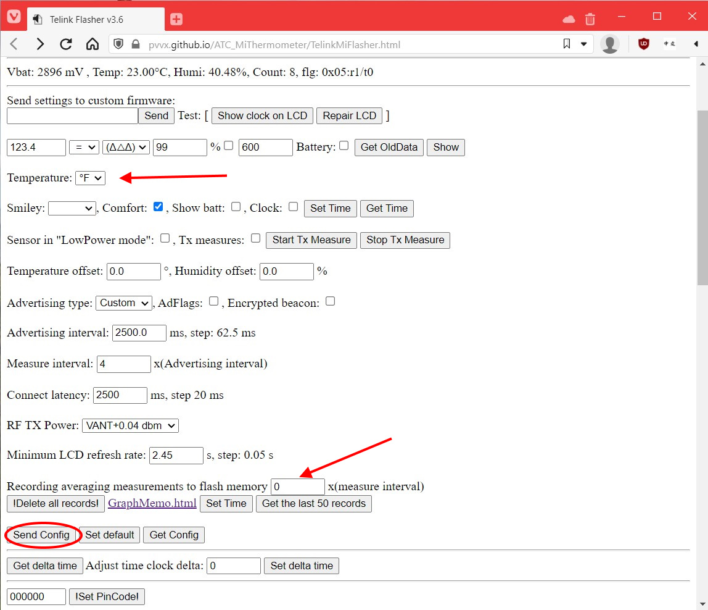

# Home Assistant room temperature and humidity with Bluetooth thermometer and ESPHome
This is one of the easiest ESPHome projects to build with no tools or soldering required. This guide explains how to integrate room temperature in [Home Assistant](https://www.home-assistant.io/) using a low cost ($5 USD) Bluetooth Low Energy (BLE) thermometer with a Bluetooth LE gateway using a low cost ($5 USD) [ESP32](https://en.wikipedia.org/wiki/ESP32) microcontroller running [ESPHome](https://esphome.io) software.


## Overview
If some rooms of your home feels warmer or colder than other rooms, then it might be useful to use a thermometer to measure and collect temperature and humidity data in specific rooms so you can make adjustments to improve home comfort. Home Assistant logs data history for any sensor and the dashboard displays a chart of historical measurements. With the Xiaomi Mijia Bluetooth thermometer, you can place the thermometer on a wall in your home without it looking out of place in a home. By using multiple thermometers in different rooms, you can compare temperature and humidity of different rooms in your home.


**Prerequisites**
- [Home Assistant](https://www.home-assistant.io/) already installed on Raspberry Pi, single board computer or PC. Check [Setup Home Assistant on a thin client](.../home-assistant/hassio-on-thin-client.md) guide as an example.

**Hardware required**
- [ESP32](https://en.wikipedia.org/wiki/ESP32) microcontroller
- Xiaomi Mijia Bluetooth thermometer (model LYWSD03MMC)
- PC with Bluetooth for initial sensor setup

**Software required**
- [Home Assistant](https://www.home-assistant.io/)
- [Telink flasher for Mi thermostat](https://pvvx.github.io/ATC_MiThermometer/TelinkMiFlasher.html)
- [ESPHome](https://esphome.io)
- [ESPHome Flasher](https://github.com/esphome/esphome-flasher)

**Tools required**
- No special tools needed, nothing to take apart or assemble.

### LYWSD03MMC Xiaomi Mijia Bluetooth thermometer
Xiaomi Mijia Bluetooth thermometer (model LYWSD03MMC) is a small smart thermometer about the size of a 9V battery.
- Has a built-in 1.5in LCD display that shows current temperature and humidity
- Displays temperature in Celsius, but can display in Fahrenheit with custom firmware
- With its white case, it can be easily mounted on a wall with included sticky pad and blends into the background without looking out of place.
- Powered by a replaceable CR2032 coin cell battery
- Has integrated Bluetooth Low Energy (BLE) wireless connectivity that will be used to integrate this sensor with Home Assistant
- Powered by Telink TLSR82xx series ultra low power [microcontroller](https://en.wikipedia.org/wiki/Microcontroller) designed for Internet of Things (IoT)

### ESP32 SoC microcontroller
ESP32 is a microcontroller that uses a System on Chip (SoC) processor that provides a lot of capability at a low price and small size. For about $5 USD, the SoC has integrated 802.11 b/g/n Wi-Fi and Bluetooth v4.2 connectivity. It's size is slightly larger than a SD card. Programs can be transferred to the onboard flash memory through micro USB cable connected to your PC or wirelessly through Wi-Fi. Device can be powered by USB cable or directly by a 5V DC power source.

#### Comparison to Arduino
Both ESP32 and Arduinos run a single program rather than an operating system. ESP32 single board computer (SBC) is much faster and has more connectivity than the similarly sized Arduino Nano microcontroller. ESP32 has 100x RAM and 10x flash memory of the Arduino Nano. Arduino Nano does not have Wi-Fi or Bluetooth.  Both devices can be powered by USB cable or directly by a 5V DC power source.

#### Comparison to Raspberry Pi
Raspberry Pi uses faster  ARM SoC processor. Even the slower Raspberry Pi Zero is much more powerful (has 1000x more RAM than ESP32) and runs a full Linux operating system at a higher cost, and uses micro SD card for storage. Both Raspberry Pi Zero W and ESP32 support 802.11 b/g/n Wi-Fi and Bluetooth. Both devices can be powered by USB cable or directly by a 5V DC power source.

### Home Assistant Bluetooth LE sensor gateway
The ESP32 microcontroller can be configured to act as a Bluetooth sensor gateway, detecting broadcasts from Bluetooth Low Energy sensors and transmitting the events to Home Assistant over Wi-Fi network. With ESP32 microcontroller's built-in Bluetooth and Wi-Fi connectivity, you don't need Bluetooth on the PC or device Home Assistant is installed on.
Bluetooth Low Energy sensors broadcasts data on a periodic basis. To prolong the sensor battery life, the ESP32 microcontroller doesn't "pair" or maintain active connection with each sensor.

## Instructions
Building this is separated into 3 phases
1. Flash Bluetooth thermometer with custom firmware
2. Update ESPHome configuration to detect Bluetooth thermometer
3. Configure Home Assistant integration for sensors in the Bluetooth thermometer

Before proceeding, you'll need Home Assistant already installed and running on a device like a Raspberry Pi. See Prerequisites section for more details.

## Step 1: Flash Bluetooth thermometer with custom firmware
To unlock additional customization options like displaying temperature in Fahrenheit units and to broadcast unencrypted sensor data, it's recommended to flash custom open source firmware on the model LYWSD03MMC Xiaomi Mijia Bluetooth thermometer. The device can be flashed wirelessly Over The Air (OTA) using a web browser on a PC with Bluetooth.
1. Follow the steps for flashing custom firmware described on [Instructions for flashing or updating firmware](https://github.com/pvvx/ATC_MiThermometer#flashing-or-updating-the-firmware-ota). GitHub contributors [pvvx](https://github.com/pvvx), [atc1441](https://github.com/atc1441), and others have done a great job developing the browser flashing tool and documenting the instructions.
   - Firmware is transferred wirelessly through Bluetooth connection. For best results, make sure the Bluetooth thermostat is close (within 1ft) from PC with browser you're flashing from.
  
2. After custom firmware is successfully transferred, follow the steps for changing configuration described in [configuration section](https://github.com/pvvx/ATC_MiThermometer#configuration) as needed. Suggested changes are:
  1. Change the LCD to display Fahrenheit units. (Temperature setting, then select "Send Config" button)
  2. Disable recording average measurments to internal flash memory to prolong the flash memory lifespan (set "Recording averaging measures to flash memory" to 0)
  3. Rename the device to indicate room device will be placed in (Enter new device name, then select "Set New Name" button)
3. When you're finished making changes, verify you've selected "Send Config", then select "Disconnect" button.
  

## Step 2: Update ESPHome configuration to detect Bluetooth thermometer
Now that your Xiaomi Mijia Bluetooth thermometer is running custom firmware and broadcasting unencrypted temperature and , the next step is to load [ESPHome](https://esphome.io) software on your [ESP32](https://en.wikipedia.org/wiki/ESP32) microcontroller and configure it to listen to temperature and humidity data broadcasted by your Bluetooth thermometer, and then re-trasnmit that data as a Home Assistant sensor.

1. In Home Assistant, install ESPHome Dasbhoard add-on by following the instructions at
[ESPHome Getting Started guide](https://esphome.io/guides/getting_started_hassio.html)
2. Within ESPHome Dashboard, select green "+ New Device" button and enter your desired device name. The device name is visible in Home Assistant Integrations page, but won't be visible on Home Assistant dashboards.
3. Select ESP32 device if using ESP32
4. Cancel install at this time, as we'll modify the configuration file first.
5. Select "Edit" button to edit the ESPHome *.yaml configuration file
6. Edit Wi-Fi network SSID and password. As a security best practice, hide the passwords in `secrets.yaml` file.
7. Add `esp32_ble_tracker:` to the bottom of the .yaml config like below
  ```yaml
  esp32_ble_tracker:
  ```
8. Select "Save", then select "Install". Choose your preferred install method. "Manual download" is the easiest method for the initial flashing. "Wireless install" is easiest flash option after ESP32 device is connected to your network.
  - If using "Manual download", then download the compiled program (*.bin file) from ESPHome Dashboard, connect ESP32 device to your PC using USB cable, and then use [ESPHome Flasher](https://github.com/esphome/esphome-flasher) software to flash *.bin program to your ESP32 device.
9. After ESP32 is flashed successfully with new configuration, view logs to determine the MAC address (ex: `A1:B1:C1:D1:E1:F1`) of your Xiaomi Mijia Bluetooth thermometer. The ESPHome Flasher utility automatically displays logs after flashing, or you can use ESPHome Dashboard and select "Logs" if your ESP32 was successfully connected to your local Wi-Fi network. Logs will show the MAC address and name of the detected Bluetooth Low Energy devices.


10. Within ESPHome Dashboard, select "Edit" button to edit the ESPHome *.yaml configuration. Use [my sample ESPHome configuration.yaml](esp-ble-temp.yaml) as a reference and add the following to the bottom of the .yaml config. Update `mac_address` with the MAC address you determined in the previous step.
```yaml
esp32_ble_tracker:

sensor:
  - platform: pvvx_mithermometer # LYWSD03MMC Mijia Therometer
    mac_address: "A1:B1:C1:D1:E1:F1" # LYWSD03MMC MAC address
    temperature:
      name: "T1 Temperature"
    humidity:
      name: "T1 Humidity"
    battery_level:
      name: "T1 Thermometer Battery Level"
    battery_voltage:
      name: "T1 Thermometer Battery Volts"

# Auto daily reset
time:
  - platform: homeassistant
    on_time:
      - seconds: 0
        minutes: 0
        hours: 4
        days_of_week: MON-SUN
        then:
           - switch.toggle: restart_switch
switch:
  - platform: restart
    name: "ESP-BLE-TEMP restart"
    id: restart_switch
```
11. Select "Save", then select "Install". Your ESP32 should have successfully connected to your Wi-Fi network and should be detected as online in ESPHome Dashboard at this point, so "Wirelessly" is the easiest option. If your ESP32 is not detected as online in ESPHome Dashboard, then double check you've configured the correct Wi-Fi SSID and password in your configuration yaml.

## Step 3: Configure Home Assistant integration for sensors in the Bluetooth thermometer
After configuring ESP32 to detect temperature and humidity broadcasted by your Bluetooth thermometer and re-transmit that as a Home Assistant sensor, the last step is to enable ESPHome integration so that ESPHome dashboard displays temperature and humidity data.

1. In Home Assistant, navigate to Integration page under Configuration -> Devices & Services.
2. ESPHome should automatically appear as a discovered integration. If not, follow [ESPHome instructions](https://esphome.io/guides/getting_started_hassio.html#connecting-your-device-to-home-assistant) to manually add ESPHome integration.
3. Select "Configure" button, and set the area of the device. Home Assistant Overview dashboard groups temperature, humidity and other sensors & switches per area by default. 
4. Check Home Assistant Overview dashboard and look for the "T1 Temperature" and "T1 Humidity" sensors.

## Conclusion
Congratulations! Now you can view and log temperature and humidity in Home Assistant using Xiaomi Mijia Bluetooth thermometer (model LYWSD03MMC). With the low cost of LYWSD03MMC Bluetooth thermometer, you can buy a few and place them in each area of your home. A single ESP32 microcontroller can detect data broadcast from multiple Bluetooth thermometers.
