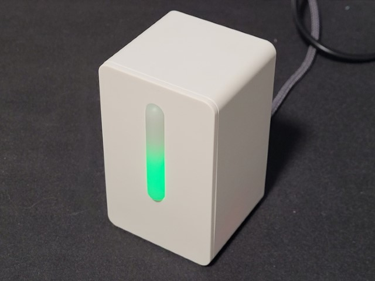
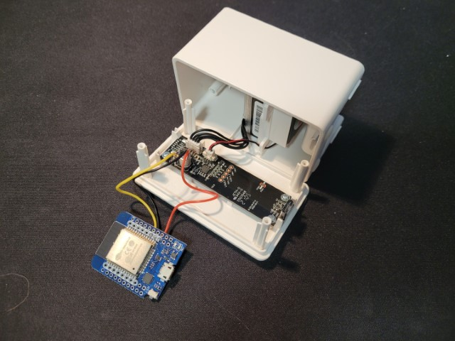

# Home Assistant air quality sensor with IKEA VINDRIKTNING and ESPHome
This guide explains how to modify a low cost ($13 USD) [IKEA VINDRIKTNING](https://www.ikea.com/us/en/p/vindriktning-air-quality-sensor-60515911/) particulate (air quality) sensor into a [Home Assistant](https://www.home-assistant.io/) smart sensor and Bluetooth Low Energy (BLE) sensor gateway by adding a low cost ($5 USD) [ESP32](https://en.wikipedia.org/wiki/ESP32) microcontroller and running [ESPHome](https://esphome.io) software.  


## Overview
ESPHome + IKEA VINDRIKTNING device can perform a few functions in a smarthome:  
1. View particulate air quality measurements in Home Assistant  
2. Act as a Bluetooth Low Energy (BLE) sensor gateway by detecting events from Bluetooth motion sensor, thermometer, or other sensors and transmitting them to Home Assistant over Wi-Fi network.  
3. Home Assistant automations can trigger actions based on detected events.  

[ESPHome](https://esphome.io) software enables connecting sensors to Home Assistant using microcontrollers like ESP8622 and ESP32.  

**Prerequisites**
- [Home Assistant](https://www.home-assistant.io/) already installed on Raspberry Pi, single board computer or PC. Check [Setup Home Assistant on a thin client](.../home-assistant/hassio-on-thin-client.md) guide as an example.  

**Hardware required**
- [IKEA VINDRIKTNING](https://www.ikea.com/us/en/p/vindriktning-air-quality-sensor-60515911/) air quality sensor
- WEMOS D1 MINI32 [ESP32](https://en.wikipedia.org/wiki/ESP32) microcontroller

**Software required**
- [Home Assistant](https://www.home-assistant.io/)  
- [ESPHome](https://esphome.io)  
- [ESPHome Flasher](https://github.com/esphome/esphome-flasher)  

**Tools required**
- small philips head screwdriver
- Soldering gun + solder
- Electrical wire
- Wire strippers  

### Particulate Matter air quality measurements
Particulate Matter (PM) are microscopic particles that are in the air and is a harmful form of air pollution that can cause health problems like heart attacks and respiratory disease. The level of airborne particulate matter can change based on weather (stagnant air) or wildfires, so measuring your home air quality can provide insight on when one needs to be cautious outdoors.  

### Home Assistant automations with Bluetooth LE sensors
With automations, Home Assistant can automatically respond and trigger actions based on sensor events. For example, turn on lights automatically at sunset. With motion sensors, automations can trigger turning on lights automatically when there's motion and turn lights off after no motion is detected for a set period of time.  

### Home Assistant Bluetooth LE sensor gateway
The ESP32 microcontroller can be configured to act as a Bluetooth sensor gateway, detecting broadcasts from Bluetooth Low Energy sensors and transmitting the events to Home Assistant over Wi-Fi network. With ESP32 microcontroller's built-in Bluetooth and Wi-Fi connectivity, you don't need Bluetooth on the PC or device Home Assistant is installed on.  
Bluetooth Low Energy sensors broadcasts data on a periodic basis. To prolong the sensor battery life, the ESP32 microcontroller doesn't "pair" or maintain active connection with each sensor.  

### IKEA VINDRIKTNING air quality sensor


[IKEA VINDRIKTNING](https://www.ikea.com/us/en/p/vindriktning-air-quality-sensor-60515911/) measures air quality with its built-in PM1006 particulate matter sensor that measures fine particulate matter (PM2.5). It's designed as a small, unassuming white box that blends into the background in a home and is powered by a USB-C cable and 5V 2A wall adapter. It contains no built-in connectivity or smarthome functionality.  

The sensor uses an optical sensing method to measure particle mass concentration (μg/m³).  
  
LED color | PM2.5 concentration | Air quality
----------|---------------------|------------
Green     | 0 to 35 μg/m³       | Good
Amber     | 36 to 85 μg/m³      | OK
Red       | Above 86 μg/m³      | Not good
  
While the sensor has an accuracy of ±20μg/m³ or ±20% of reading, the IKEA VINDRIKTNING is only able to display air quality as 1 of 3 colors in stock form out of the box. It has no memory or history function. Modifying it by adding a ESP32 microcontroller and connecting it to Home Assistant will unlock the full functionality of the particulate sensor.  

### ESP32 SoC microcontroller
ESP32 is a microcontroller that uses a System on Chip (SoC) processor that provides a lot of capability at a low price and small size. For about $5 USD, the SoC has integrated 802.11 b/g/n Wi-Fi and Bluetooth v4.2 connectivity. It's size is slightly larger than a SD card. Programs can be transferred to the onboard flash memory through micro USB cable connected to your PC or wirelessly through Wi-Fi. Device can be powered by USB cable or directly by a 5V DC power source.  

#### Comparison to Arduino
Both ESP32 and Arduinos run a single program rather than an operating system. ESP32 single board computer (SBC) is much faster and has more connectivity than the similarly sized Arduino Nano microcontroller. ESP32 has 100x RAM and 10x flash memory of the Arduino Nano. Arduino Nano does not have Wi-Fi or Bluetooth.  Both devices can be powered by USB cable or directly by a 5V DC power source.  

#### Comparison to Raspberry Pi
Raspberry Pi uses faster  ARM SoC processor. Even the slower Raspberry Pi Zero is much more powerful (has 1000x more RAM than ESP32) and runs a full Linux operating system at a higher cost, and uses micro SD card for storage. Both Raspberry Pi Zero W and ESP32 support 802.11 b/g/n Wi-Fi and Bluetooth. Both devices can be powered by USB cable or directly by a 5V DC power source.  

## Instructions
Building this is separated into 3 phases  
1. ESPHome software configuration and flashing the ESP32 microcontroller
2. Hardware - opening IKEA VINDRIKTNING device and connecting ESP32 microcontroller
3. Home Assistant integration and automation

## Step 1: ESPHome software configuration and flashing ESP32 microcontroller
This step configures your ESP32 microcontroller to connect to your Wi-Fi network so you can later wirelessly flash configuration updates to it. This is essential as the ESP32 microcontroller's USB port won't be accessible after ESP32 is placed inside the IKEA VINDRIKTNING case.  

1. In Home Assistant, install ESPHome Dasbhoard add-on. Detailed instructions are at
[ESPHome Getting Started guide](https://esphome.io/guides/getting_started_hassio.html)  
2. Within ESPHome Dashboard, select green "+ New Device" button and enter the device name. The device name is visible in Home Assistant Integrations page, but won't be visible on Home Assistant dashboards.  
3. Select ESP32 device if using a ESP32  
4. Cancel install at this time, as you'll need to modify configuration file first.  
5. Select "Edit" button to edit the ESPHome *.yaml configuration file
6. Edit Wi-Fi network SSID and password. As a security best practice, hide the passwords in `secrets.yaml` file.  
7. Use [my sample ESPHome configuration.yaml](esp-ikea.yaml) as a reference and add the following to the bottom of the .yaml config.   
  ```yaml
  uart:
    rx_pin: GPIO16 # ESP32 UART RX2 pin
    baud_rate: 9600

  sensor:
    - platform: pm1006 # sensor in IKEA VINDRIKTNING
      pm_2_5:
        name: "PM1 Particulate Matter <2.5µm"

  # Auto daily reset
  time:
    - platform: homeassistant
      on_time:
        - seconds: 0
          minutes: 0
          hours: 4
          days_of_week: MON-SUN
          then:
             - switch.toggle: restart_switch
  switch:
    - platform: restart
      name: "ESP-IKEA restart"
      id: restart_switch
  ```
8. Select "Save", then select "Install". Choose your preferred install method. "Manual download" is the easiest method for the initial flashing. "Wireless install" is easiest flash option after ESP32 device is connected to your network  
  - If using "Manual download", then download the compiled program (*.bin file) from ESPHome Dashboard, connect ESP32 device to your PC using USB cable, and then use [ESPHome Flasher](https://github.com/esphome/esphome-flasher) software to flash *.bin program to your ESP32 device.  
9. Verify ESPHome Dashboard displays your ESP32 device as green "Online", which indicates your ESP32 microcontroller successfully connected to your home network. After ESPHome Dashboard displays your ESP32 device as online, you can move on to the next section.  

## Step 2: IKEA VINDRIKTNING disassembly and wiring the ESP32 microcontroller
Next step is to open the case of IKEA VINDRIKTNING and wire its sensor and DC power to the ESP32 microcontroller. The ESP32 microcontroller does not need to be powered with separate USB cable, as it draws power from the same USB cable as IKEA VINDRIKTNING.  

1. Turn on and warm up your soldering iron :)  
2. From the back of the case, use small philips screwdriver to unscrew the 4 screws and carefully open the back cover. The back cover has wires that attach a circuit board to the particulate sensor inside the case.  
3. Cut 3 wires (prefer 1 red wire for 5V, 1 black wire for ground, and 1 other color wire for data), each about 4.5 inches long. Strip both ends of the wire, about 1/8 inch.  
4. Solder the 3 wires to the ESP32 device, then to the IKEA VINDRIKTNING circuit board test pads using the connections in the table below.  

  Wire color  | ESP32 pin| IKEA VINDRIKTNING circuit board pin | Notes
  --|---|---|--
  Red | VCC | +5V | 5V from USB cable
  Black | GND | GND | Ground
  Yellow | RX2 (GPIO16) | REST | UART serial connection to PM1006 sensor  

  

    
5. Test the connections. Connect USB-C cable directly to the port on the IKEA VINDRIKTNING circuit board. Check that the ESP32 device powers on and is detected in the ESPHome dashboard.  
6. Carefully slide the ESP32 underneath the sensor/fan inside the case.
    

    
6. Carefully close the back cover while avoiding pinching the wires. Keep the space above the sensor open to minimize interfing with the sensor airflow that could affect measurement accuracy.  

## Steps 3: Home Assistant integration and automation
After wiring ESP32 microcontroller to the sensor inside the IKEA VINDRIKTNING, the last step is to enable ESPHome integration so that ESPHome dashboard displays PM2.5 concentration data.  

1. In Home Assistant, navigate to Integration page under Configuration -> Devices & Services.
2. ESPHome should automatically appear as a discovered integration. If not, follow [ESPHome instructions](https://esphome.io/guides/getting_started_hassio.html#connecting-your-device-to-home-assistant) to manually add ESPHome integration.
3. Select "Configure" button, and set the area of the device.
4. Check Home Assistant Overview dashboard and look for the "Particulate Matter <2.5µm" sensor.

## Conclusion
Congratulations! You can now check precise values of PM2.5 concentration from a IKEA VINDRIKTNING air quality sensor and log and view sensor history in Home Assistant.  
The ESP32 microntroller can also work as a Bluetooth Low Energy sensor scanner. With ESP32 microcontroller's built-in Bluetooth, you don't need Bluetooth on the PC or device Home Assistant is installed on. Home Assistant can automatically respond and trigger actions based on sensor events.
