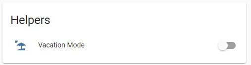

# Vacation mode lighting with historical replay
This guide explains how to create a vacation mode toggle switch in [Home Assistant](https://www.home-assistant.io/) dashboard that turns on and off smart lights when you're away following historical patterns. This way, the smart lights in your home will turn on and off when you are away in the same patterns as when you were home.



## Overview
Want to create the impression that someone is home at night even when you're away? Home Assistant can record the history of when your smart lights were turned on and control your smart lights to turn on and off when you're away from home in the same pattern as when you were at home. 

**Prerequisites**
- [Home Assistant](https://www.home-assistant.io/) already installed on Raspberry Pi, single board computer or PC. See [Setup Home Assistant on a thin client](.../home-assistant/hassio-thin-client-setup.md) guide as an example.
- Completed setup and configuration of Home Assistant integration for your smart Wi-Fi plug, light bulb, or light switch.

**Hardware required**
- Smart Wi-Fi plug, light bulb, or light switch compatible with Home Assistant (ex: Philips Hue, Belkin WeMo, TP-Link Kasa)

**Software required**
- [Home Assistant](https://www.home-assistant.io/)

**Tools required**
- No special tools needed, nothing to take apart or assemble.

## Instructions
This guide is organized into the following phases

1. Enable Recorder integration in Home Assistant to store activity history in a database.
2. Create a "Vacation Mode" toggle switch in Home Assistant dashboard
3. Create a `history_stats` sensor entity to save the historical activity of each smart light or switch.
4. Create automation that turns smart lights on and off based on the corresponding `history_stats` data

### Enable Recorder integration in Home Assistant
If you haven't already, you need to configure [`recorder`](https://www.home-assistant.io/integrations/recorder) Home Assistant integration to store activity history in a database.

1. In `configuration.yaml`, add the example below to record activity for the last 30 days in the database.  
    ```yaml
    recorder:
    purge_keep_days: 30 # number of history days to keep in recorder database
    exclude: # exclude some activity to save storage space
        domains:
        - updater
        entity_globs:
        - sensor.weather_*
        entities:
        - sun.sun # Don't record sun data
        - sensor.last_boot # Comes from 'systemmonitor' sensor platform
        - sensor.date
        event_types:
        - call_service # Don't record service calls
    ```
2. Check if your `configuration.yaml` is valid after editing using "check configuration" link in "Developer Tools", [YAML or Server Controls page](https://my.home-assistant.io/redirect/server_controls/).
  
3. Select "Restart" to restart Home Assistant with the new configuration.  

### Create a Vacation Mode toggle switch in Home Assistant dashboard
In `configuration.yaml`, add the example below to add a toggle switch to Home Assistant dashboard.  

```yaml
input_boolean:
  # Vacation Mode Toggle: Used as the condition for vacation lighting automation
  vacation_mode:
    name: Vacation Mode
    icon: mdi:beach
```


### Create a `history_stats` sensor entity to save the historical activity of each smart light or switch.
In `configuration.yaml`, add the example below to add create a `history_stats` sensor entity for every smart light or switch you want to include in vacation mode lighting. You need to copy/paste and create separate entities if you want to include multiple devices in vacation mode.

*Note:* Home Assistant `recorder` integration need to be configured to save data from at least the last 7 days in this example. `86400` is the number of seconds in a day (24 hours), so `7*86400` is equal to 1 week (7 days).

```yaml
sensor:
  # Replay Sensor - Make a new one for each light to monitor
  # All sensors will have naming convention "sensor.replay_xxxxx"
  - platform: history_stats
    name: "replay_kitchen_light"
    entity_id: switch.kitchen_light
    state: "on"
    type: count
    start: >
      {{ as_timestamp(now()) - (7*86400) }}
    duration: 00:00:30
```

### Create automation that turns smart lights on and off based on the corresponding `history_stats` data
The last steps is to create the Home Assistant automation that runs when the Vacation Mode toggle switch is turned on.  

1. Select the button below to import the blueprint into your Home Assistant.  
   [](https://my.home-assistant.io/redirect/blueprint_import/?blueprint_url=https%3A%2F%2Fgithub.com%2Fjturn08%2Fsmarthome%2Fblob%2Fmain%2Fhome-assistant%2Fblueprints%2Fvacation-lighting.yaml)  

   **OR** in Home Assistant, go to [Configuration](https://my.home-assistant.io/redirect/config) and then [Blueprints](https://my.home-assistant.io/redirect/blueprints). Click on the blue [Import Blueprint](https://my.home-assistant.io/redirect/blueprint_import/?blueprint_url=https%3A%2F%2Fgithub.com%2Fjturn08%2Fsmarthome%2Fblob%2Fmain%2Fhome-assistant%2Fblueprints%2Fvacation-lighting.yaml) button in the bottom right and enter the blueprint URL.
   ```url
   https://github.com/jturn08/smarthome/blob/main/home-assistant/blueprints/vacation-lighting.yaml
   ```
2. In Home Assistant, go to [Configuration](https://my.home-assistant.io/redirect/config) and then [Automations & Scenes](https://my.home-assistant.io/redirect/automations/). Select the blue "**+ Create Automation**" button in the lower right corner.  
3. Select the "Vacation Lighting" blueprint  
4. Enter the automation name (ex: *Vacation Mode Lighting*)  
5. Select the `history_stats` replay sensor that was created in your `configuration.yaml`
6. Select the corresponding target light or switch entity. 
7. Repeat steps #5 and #6 for each replay sensor and light entity.  
*Note:* If you want to control a different number of entities (smart lights), then you need to modify the blueprint to match the number of entities for your home.  

## Conclusion
Congratulations! When you turn on Vacation Mode, Home Assistant will turn on and off your smart lights even when you are away using the same patterns as when you were home.  

For more information, see
* https://community.home-assistant.io/t/vacation-lighting-replay-historical-lighting/282435