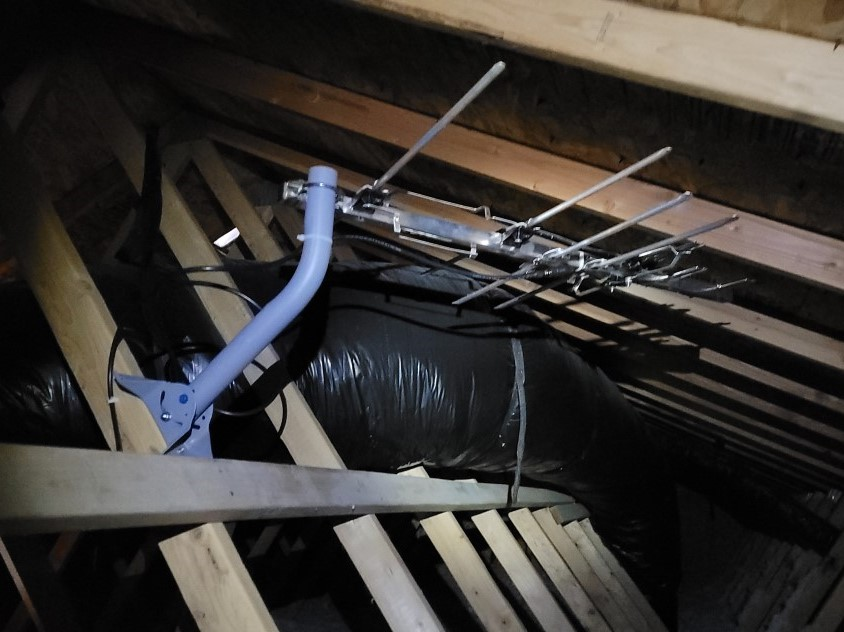
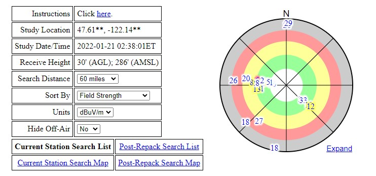
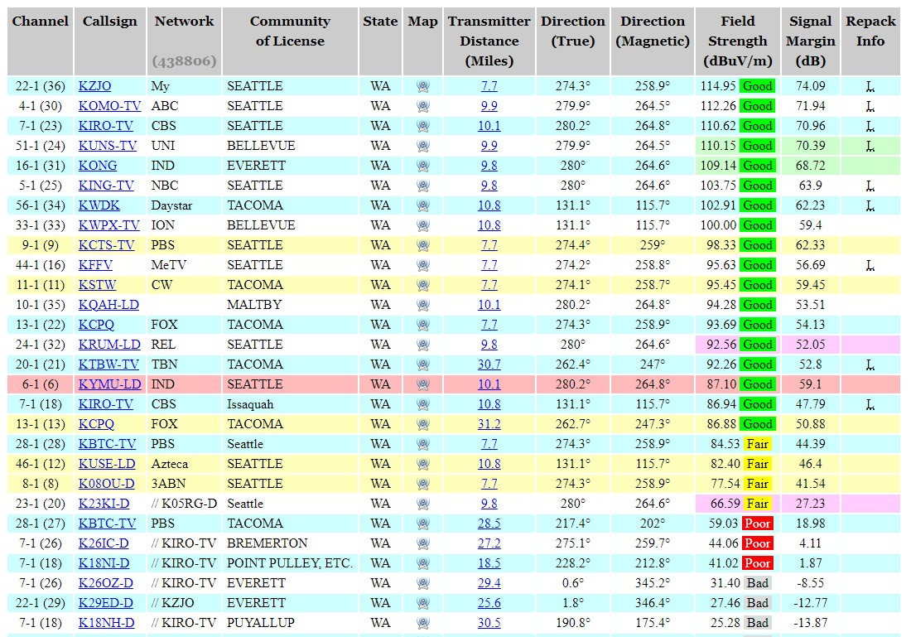
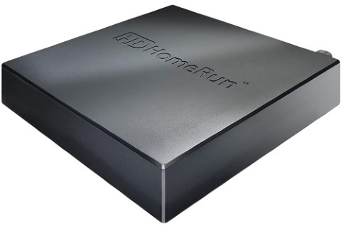
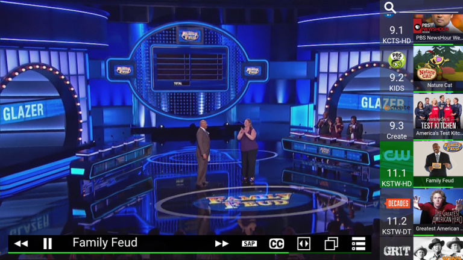

# Cord-cutting with long range attic TV antenna + HDHomeRun network TV tuner
This guide explains how to "cut-the-cord" and improve local TV channel reception using a long range TV antenna mounted in the attic and enable watching live TV on a tablet or smartphone using a HDHomeRun network TV tuner, all with no monthly subscription fees.

## Overview
Cutting-the-cord on cable/satellite TV can save money every month, but that doesn't mean having to put up with bad TV signals that periodically cuts out, or having to physically adjust the placement of a TV antenna depending on which channel you're watching. Installing a long range TV antenna in the attic can improve TV channel reception to completely eliminate TV signals cutting out. Even with a TV antenna, you can still watch live TV on a smartphone or tablet with no monthly subscription fee using a HDHomeRun network TV tuner.  

**Hardware required**
- Long range TV antenna
- RG-6 type coaxial cable (25 to 50ft)
- HDHomeRun network TV tuner

**Tools required**
- Ladder for access to home attic
- Power drill
- Screwdriver

## Checking which TV channels you can receive with an over-the-air TV antenna
To see which TV channels you can expect to get with different types of antenna based on your location, use [RabbitEars.info Signal Search Map](https://www.rabbitears.info/searchmap.php). Enter your address, check the location found on the map, and then select Go button to display signal search results.

The circular chart shows the location (direction and distance) of the TV broadcast towers closest to your home. Select the "Expand" link to view a larger chart. With the appropriate TV antenna, you can expect to receive all the "Good" and most of the "Fair" TV channels.  
The table below the circular chart includes details of each TV station and the distance & direction of the broadcast tower from your location.  

## Selecting a TV antenna type and antenna location
**Directional vs Omni-directional:** Check if most of the TV broadcast towers with "Good" signal strength are located in the **same  direction** (within 45°), or if the TV broadcast towers are in **opposite directions.** If TV broadcast towers are in the same direction, then choose a directional TV antenna for best reception. If TV broadcast towers are in different or opposite directions, then choose a omni-directional TV antenna for best reception.  
**VHF vs UHF**: Review the TV channel numbers with "Good" signal strength. The first number (ex: 4-1) is the display channel that is shown on your TV, the second number in () is the physical channel. For most locations, TV stations in your location will broadcast in both VHF (physical channels 2 to 13) and UHF (physical channels 14 to 51) frequency ranges, so you'll need to choose an antenna designed for both VHF and UHF frequencies.  
**Indoor vs "outdoor" antenna**: If you your live TV picture or audio cuts out with tabletop or flat panel indoor TV antennas, then you try the following options:
1. Use a powered signal amplifier with your exsting indoor TV antenna, but a signal amplifier does not fix signal interference issues storm clouds or cars and trucks driving by.
2. Install a large outdoor TV antenna on or near the roof. Installing an outdoor TV antenna may not be a good option, as it’s unsightly, requires perioidic maintenance and repair from being mounted outdoors, and is difficult to install (drilling into wall or roof, grounding to prevent damage from lightning strikes).
3. Install a large indoor HDTV antenna in on a wall inside your home, but that would look unsightly.  
4. Install a large TV antenna in the attic. Get all the benefits of an "outdoor" TV antenna, with easier installation and no wear & tear from being outdoors.  
  
This guide explains the last option.  
  
## Connecting antenna to your TVs
You can distribute antenna TV signal throughout your home using existing in-wall coaxial wiring, or use a network TV tuner device so you can watch using an app on a smartphone, tablet, or computer.

### HDHomeRun network TV tuner (Recommended)
With a HDHomeRun network TV tuner device, one can watch TV from a smart TV, smartphone, tablet, or computer with no subscription fees. HDHomeRun devices comes in multiple versions with 2 or 4 tuners.  
  
The HDHomeRun device connects to your TV antenna and to your home network with an ethernet cable, and you can watch TV on using HDHomeRun app on a TV or mobile device connected to your home network.  

Screenshot from HDHomeRun Android app running on my smartphone with TV listings

### Re-use in-wall coaxial wiring (Recommended)
If you have "cut the cord" (canceled cable/satellite TV service), then you can re-use your home's existing in-wall coaxial wiring to connect your main antenna to the TV in every room. First, locate the service box that has the coaxial cable to each room. Next, route the antenna cable to this service box, and connect your antenna and coaxial cable to each room to a splitter or distribution amplifier. A distribution amplifier may be needed to maintain signal strength if the TV antenna signal is split to multiple rooms.  