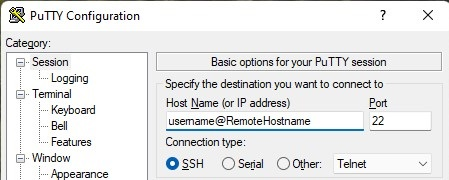
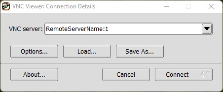
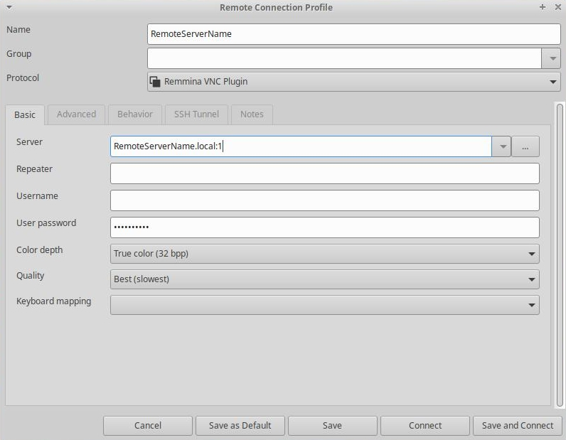
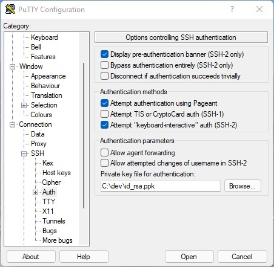
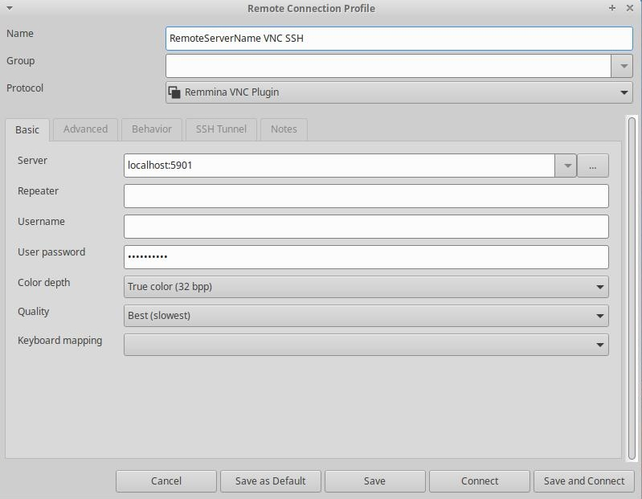
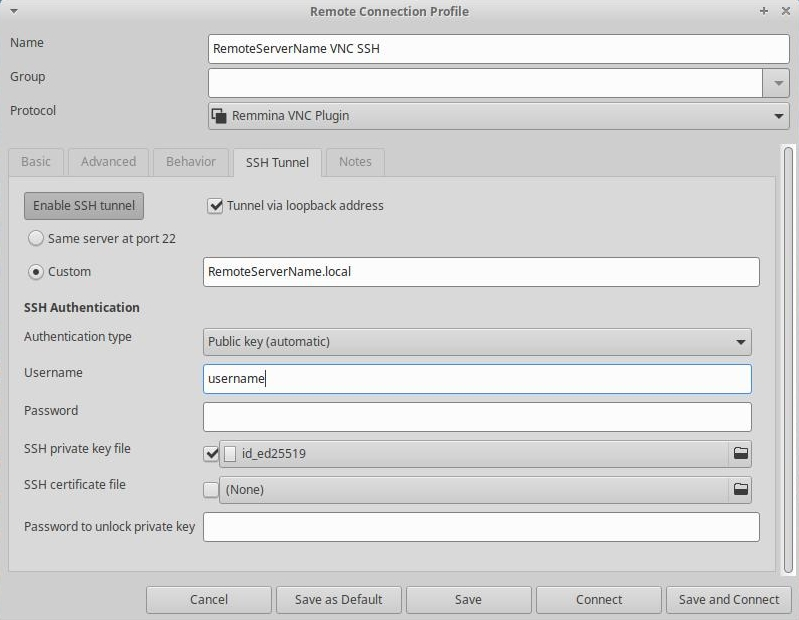
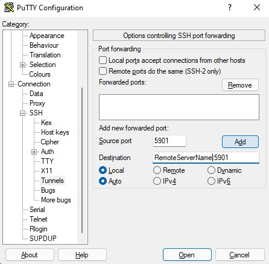

# Configuring remote acess to a linux PC
This guide illustrates how to remotely access a Linux PC's terminal shell using SSH and graphical desktop using VNC server software.  

**Note:** The following instructions were tested with Xubuntu 21.10, but should also work with most Ubuntu and Debian based Linux distros.  

## Overview
Windows 10 Pro and Windows 11 Pro includes Remote Desktop Services (RDP) that enables another computer to remotely view desktop environment. The same functionality is available in Linux using SSH and VNC server. 
- SSH stands for "Secure Shell". It provides a secure terminal (i.e. command prompt) for running commands on a remote computer. 
- VNC stands for "Virtual Network Computing". It provides remote control of a graphical desktop.

Reasons for remote access to a Linux PC
- Apply software updates and change OS configuration settings on a PC from a different room  
- Access a desktop environment on a "headless" PC with no connected monitor

You can connect to the linux PC (i.e. the remote server) from another computer (i.e. the client) running Linux, Windows, or Mac.  

## Enabling remote terminal shell using SSH
SSH stands for "Secure Shell". It provides a secure terminal (i.e. command prompt) for running commands on a remote computer.  Most Linux-based operating systems include a **SSH client** that can connect to a remote **SSH server**.

On the remote Linux PC you want to connect to, enable SSH server using following instructions
1. Install `openssh-server` package using commands below.
   ```
   sudo apt update
   sudo apt install openssh-server
   ```
2. After installation is completed. Verify SSH service is running using
   ```
   sudo systemctl status ssh
   ```
3. Configure firewall to open SSH port (22) using
   ```
   sudo ufw allow ssh
   sudo ufw enable
   ```
4. Connect to the SSH remote server from another computer (i.e. the client).
   - Linux client: Run `ssh username@RemoteServername.local`. (Change `username` and `RemoteServername` to your actual remote server's username and hostname.)
   - Windows client (PuTTY):  
     

## Enabling remote graphical desktop using VNC
VNC stands for "Virtual Network Computing". It provides remote control of a graphical desktop, similar to Remote Desktop Services (RDP) on Windows. A **VNC client** displays the graphical desktop from a remote **VNC server**.

Linux VNC server examples:
  * [TigerVNC](https://tigervnc.org)
  * [TightVNC](https://tightvnc.com/)
  * x11VNC

Linux VNC clients examples:
  * [Remmina](https://remmina.org) - Open source, also supports RDP

Windows VNC clients examples:
  * [TigerVNC](https://tigervnc.org) viewer 
  * [UltraVNC](https://uvnc.com)

This guide uses [TigerVNC](https://tigervnc.org) and is for people running Xubuntu with Xfce4 desktop environment that runs web browser and other windows apps. If you installed a "server" edition Linux OS that only includes terminal shell, then there's an extra step of installing desktop environment (ex: `xfce4`).  

Instructions: 
1. Install TigerVNC server software by running:
   ```
   sudo apt install tigervnc-standalone-server
   ```
2. Create a VNC password by running:
   ```
   vncpasswd
   ```
   You can run the same command to change the password.
3. Edit `~/.vnc/xstartup` file to start a xfce4 desktop session whenver `vncserver` is started by running 
   ```
   nano ~/.vnc/xstartup
   ```
   
   Example `~/.vnc/xstartup` file
   ```bash
   #!/bin/sh

	unset SESSION_MANAGER
	unset DBUS_SESSION_BUS_ADDRESS
	startxfce4
   ```
5. Edit `~/.vnc/xstartup` file permissions to make it executable by running
   ```bash
   chmod +x ~/.vnc/xstartup
   ```
6. Edit `~/.vnc/config` file to set default options like resolution and color depth by running
   ```
   nano ~/.vnc/config
   ```
   
   Example `~/.vnc/config` file
   ```
   geometry=1920x1080
   depth=32
   localhost=no
   ```
   `geometry` specifies the default desktop resolution. Default is 1024x768
   `depth` specifies the color depth. Default is 24, other possible values are 16 and 32.
   `localhost=no` allows connections from other PCs during testing. Remove this after successfullly configuring VNC through SSH tunnel later in this guide.
7. Start VNC server by running
   ```
   vncserver
   ```   
8. Connect to the remote server from a VNC Client on a different computer by connecting to `RemoteServerName:1`. (Change `username` and `RemoteServerName` to your actual remote server's username and hostname.)  
   - Windows client (TigerVNC viewer):  
     
   - Linux client (Remmina):  
     
9.  List running VNC servers by running
   ```
   vncserver -list
   ```
11. Stop the first VNC server instance by running
   ```
   vncserver -kill :1
   ```

## Configuring SSH secure remote access with public key cryptography
SSH key based authentication serves as a secure replacement for password based authentication, so you can securely login with the private key file you have instead of a password you remember.  

In SSH public key authentication, there are two keys involved:
1. The private key known only to the owner - saved on the client (local compouter) at `~/.ssh/id_ed25519`. Treat the private key like a password and store it securely.   
2. The public key that can be shared to remote servers the owner wants to connect to - saved on the client at `~/.ssh/id_ed25519.pub` and on the remote server in `~/.ssh/authorized_keys`.  

Instructions:  
1. Create public & private key for each client (local computer)..  The key itself can optionally be password protected. By default `ssh-keygen` generates a key using the RSA-SHA2-SHA256 algorithm with a 3072 bits key length. Current best practice is to use Ed25519 type keys which offers comparable security with faster performance. If you prefer to use RSA keys, replace `id_ed25519` with `id_rsa` in the following examples.
	- Linux client: Run
	  ```
	  ssh-keygen -a 100 -t ed25519
	  ```
	  The public key is saved to `~/.ssh/id_ed25519.pub`. The private key is saved to `~/.ssh/id_ed25519`.  
	- Windows client (PuTTY): use **PuTTYgen** to generate keys. Select "EdDSA Ed25519 (255 bits)" key type, then select Generate button. Save the public key and save the private key files. Next, in PuTTY client configuration, select the `.ppk` private key file in PuTTY configuration Connection, SSH, Auth, *Private key file for authentication:* setting.  
    
2. Add the client public key to the remote server's SSH authorized keys list
	- Linux client (ssh-copy-id): Add the client's public key (`~/.ssh/id_ed25519.pub`) to the remote server's SSH authorized keys list by running. 
	  ```
	  ssh-copy-id user@RemoteServerName.local
	  ```
	  *Note:* This requires a separate working authentication method (ex: password or a separate key) to the SSH server.
	- On remote server (manual): Add client's public key (`~/.ssh/id_ed25519.pub`) to the remote server's authorized key list at `~/.ssh/authorized_keys`. Add a new line for every key.
	  ```
	  nano ~/.ssh/authorized_keys
	  ```
3. Test the SSH connection with a public key instead of password. 
   - Linux client:
     ```
	 ssh user@RemoteServerName.local
	 ```
	 (Change `username` and `RemoteServerName` to your actual remote server's username and hostname.)  
   - If connecting to the remote server for the first time, the SSH client will warn you that your local computer doesn't recognoize the remote server. Select `yes` to continue.
4. After verifying SSH connection with public key works, you can disable password-based SSH authentication on the remote server by specifying `PasswordAuthentication no` in `/etc/ssh/sshd_config` file. 
5. To apply the settings, you must restart the ssh service by running
	```
	sudo systemctl restart ssh
	```

## Configuring secure remote desktop using VNC through SSH tunnel
For improved security, the VNC server can be configured to only accept connections through a SSH tunnel.  

Instructions:  
1. Specify tunnel in SSH client.  
   (Change `username` and `RemoteServerName` to your actual remote server's username and hostname.)  

	- Linux client (Remmmina VNC with SSH Tunnel):  
	  *Note:* specify server as `localhost:5901`, then configure SSH Tunnel to the actual remote server name.  
	    
  
	    
    - Linux client: 
 	  ```
	  ssh -L 5901:localhost:5901 username@RemoteServerName.local
	  ```
	- Windows client (PuTTY): In PuTTY configuration Connection, SSH, Tunnels, enter `5901` in Source port, `RemoteServerName:5901` in Destination, and select `Add` button.  
      
2. Edit `~/.vnc/config` file to improve security by editing `localhost` line to only allow remote VNC connections through SSH tunnel.
   ```
   nano ~/.vnc/config
   ```
   
   Example `~/.vnc/config` file
   ```
   geometry=1920x1080
   depth=32
   localhost
   ```

   *Optional.* Add `SecurityTypes=none` to allow VNC connections without a VNC password.